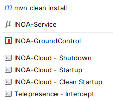

# INOA IoT Platform

INOA is a lightweight IoT integration platform that
will help you to easily start with your IoT project and offer you the needed infrastructure to develop, deploy, maintain
and scale your solutions. With INOA we want to enable users to stay in control of their IoT gateways and measured and/or
controlled devices.

## Developer Setup

### Pre-Requisites

#### Hardware

* >= 32GB RAM

#### Development Tools

Please install the following components to your system. Otherwise, you will face errors during the setup process!

* [Git](https://git-scm.com/) >= 2.25
* [Java Development Kit](https://openjdk.org/install/) >= 17.0.8 & < 21
* [Maven](https://maven.apache.org/) >= 3.6.3
* [Docker](https://www.docker.com/) >= 24.0.5
* [k3s](https://k3s.io/)
* [Python](https://www.python.org/) >= 3.8.5 (for documentation only)
* [Node.js](https://nodejs.org/en/download/package-manager) >= 18.20
* [Telepresence](https://www.getambassador.io/docs/telepresence/latest/install) >= v2.19.6


#### Setup developer environment

* Clone the project from `git@github.com:inoa-io/inoa-cloud.git`
* Use an IDE of your choice, recommended is IntelliJJ
* Import the project as Maven project in your IDE
* Be sure all annotation processors are active in your IDE
* copy [.env.template](../../.env.template) into a local `.env` file where you can set your local properties.


#### Docker Repository Access

* GitHub Container Registry - use `docker login ghcr.io` to initially authenticate against GitHub container registry
  * `ghcr.io/grayc-de`
  * `ghcr.io/inoa-io`

### Start Local Instance

#### Use IntelliJ

For IntelliJ, there are some run configurations prepared to easily jump into and let INOA run locally.



These are the steps you can do:

1. `INOA-Cloud - Startup` - Start the whole INOA cloud setup within k3s. After start it will open the INOA Developer Cockpit in your browser with useful links.
2. `INOA-Service` - Start the INOA service locally in JVM and intercept the traffic (http, mqtt) from your k3s instance.
3. `INOA-GroundControl` - Start INOA GroundControl locally via Yarn in development mode.
4. `INOA-Cloud - Shutdown` - Close the telepresence connection (if opened) and shutdown all running INOA Cloud services.
5. `Telepresence - Intercept` - Intercepts the requests for the INOA service (http, mqtt). Is called by `INOA-Service`. Only needed if you launch INOA Service in another way.

#### Use Linux Shell

For bash there are some scripts that should help to execute the INOA components:

1. Start the whole INOA Cloud setup within k3s. After start it will open the INOA Developer Cockpit in your browser with useful links.

    ```shell
    ./inoa-startup.sh
    ```
2. Intercepts the requests for the INOA service and forwards it to local ports: http (:4300) and mqtt (:1884). Used to route traffic to your local instance of the INOA Service.

    ```shell
    ./telepresence-intercept.sh
    ```

3. Close the telepresence connection (if opened) and shutdown all running INOA Cloud services.

    ```shell
    ./inoa-shutdown.sh
    ```
#### Use Windows Scripts

1. Launch INOA Cloud Locally. Work in progress....

    ```bash
    # Launch INOA Cloud Locally
    ./inoa-startup.bat
    ```

#### Use Maven & Yarn

1. Build INOA Cloud services and start the whole environment via k3s:

    ```shell
    source .env
    mvn k3s:rm
    mvn clean install
    mvn clean pre-integration-test -Dk3s.failIfExists=false -pl ./test/
    ```

2. Check the now running services via [http://help.<YOUR_IP>.nip.io:8080/](http://help.127.0.0.1.nip.io:8080/).
3. Start a local instance of INOA GroundControl for UI development:

    ```shell
    source .env
    cd app
    yarn install
    ng serve
    ```


## INOA Modules

### INOA Fleet

INOA Fleet is the swiss army knife to manage your IoT devices and gateways in a simple way. With help of some great open
source tools, it is the cockpit for a fleet of IoT devices.

### INOA Measurement

INOA Measurements is the place where all the measured data is going in. It collects, stores, enhances measurements that
are collected by IoT devices and provide it with help of APIs and UIs.

### INOA Ground Control

INOA Ground Control is the UI to manage the IoT Fleet with INOA.

### INOA OS

INOA OS is our operating system for INOA connected IoT devices and gateways.

Please find the documentation [here](https://inoa-io.github.io/inoa-os-esp32/).

### INOA Satellite

The INOA-Satellite is a small IoT gateway made for gathering various of different measurements and forwarding them to Inoa
Measurement.

Please find the documentation [here](https://inoa-io.github.io/satellite/).
