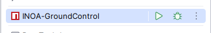

# INOA Ground Control

## Context

Ground Control is the UI of INOA Fleet and the door to all Satellites.

It is build as a single page app with help of [Angular](https://angular.io/).

## Developer Setup

### Pre-Requisits

* [Node.js](https://nodejs.org/en/download/package-manager) >= 18.19 with [Yarn 4](https://yarnpkg.com/getting-started/install)

### Build & Launch

1. Simply from a shell

   ```shell
   source .env
   cd app
   yarn install
   ng serve
   ```

2. Via prepared IntelliJ run configuration

   

## Deployment

Ground Control is (currently) not deployed standalone.
Instead, it's compiled output is delivered via the INOA Fleet service docker image, that contains the app.
