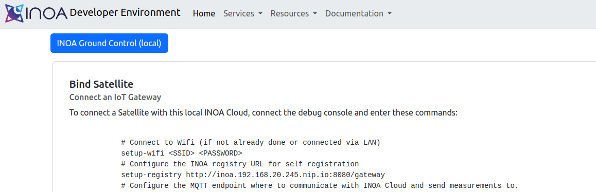

# Developer Setups

## Overview

This page describes the possible configurations and setup types for local INOA development.

## Deployment View

## Setup Types

### Pure k3s Only

#### Purpose

This setup is useful to try out INOA locally or to develop and debug INOA OS.

#### Usage

1. Simply execute the matching `./inoa-startup` script for your OS in the project root directory. *This will run a maven build, that compiles all java resources, builds GroundControl, generates Docker images and starts the integration test environment via k3s inside docker.*
2. The INOA Developer Environment page is opened in a browser that provides useful links and some possible next steps.

    

3.

### Local INOA Cloud with k3s

### Local GroundControl with k3s
