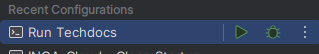

# INOA Documentation

## Description

[INOA Home](https://www.inoa.io/)

## Local Setup

### Pre-Requisits

1. [npx](https://www.npmjs.com/package/npx) version 10.2.2

   ```shell
   npm install -g npx
   ```
2. [PlantUML](https://plantuml.com/) for diagrams
3. [Draw.io](https://www.drawio.com/) editor or use the [online version](https://app.diagrams.net/?src=about)

### Set-Up & Start

1. Launch the techdocs via npx locally:

   ```sh
   cd docs/techdocs
   npx @techdocs/cli serve -v -i  ghcr.io/grayc-de/techdocs:latest
   ```
2. or launch via IntelliJ Run Configuration:

   

## Known Issues

### Draw.io Diagrams

In case you are using Draw.io for diagramming, you must manually export and add the image as SVG or PNG.
This could be solved with these plugins:

1. [mkdocs-drawio-file](https://pypi.org/project/mkdocs-drawio-file/) - renders draw.io diagrams directly inside the browser with draw.io plugin.
   <br/>**--> Doesn't work inside of Backstage, because it blocks external javascripts**
2. [mkdocs-drawio-exporter](https://pypi.org/project/mkdocs-drawio-exporter/) - exports draw.io diagrams into images (svg or png) and rewrites the links.
   <br/>**--> Doesn't work because the docker image for techdocs doesn't have a drawio executable and I was not able to install it into Alpine.**

