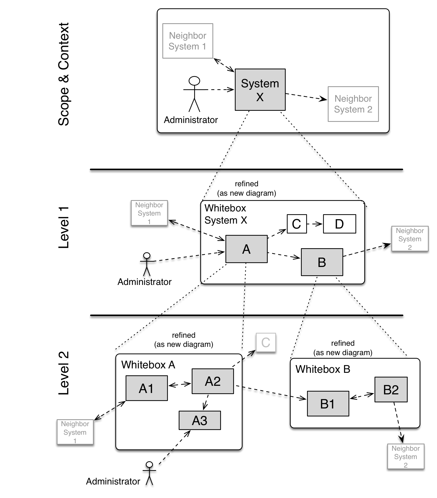

# Building Block View

??? tip

    **Contents**

    The building block view shows the static decomposition of the system
    into building blocks (modules, components, subsystems, classes,
    interfaces, packages, libraries, frameworks, layers, partitions, tiers,
    functions, macros, operations, datas structures, ...) as well as their
    dependencies (relationships, associations, ...)
    This view is mandatory for every architecture documentation. In analogy
    to a house this is the *floor plan*.

    **Motivation**

    Maintain an overview of your source code by making its structure
    understandable through abstraction.
    This allows you to communicate with your stakeholder on an abstract
    level without disclosing implementation details.

    **Form**

    The building block view is a hierarchical collection of black boxes and
    white boxes (see figure below) and their descriptions.

    

    **Level 1** is the white box description of the overall system together
    with black box descriptions of all contained building blocks.

    **Level 2** zooms into some building blocks of level 1. Thus it contains
    the white box description of selected building blocks of level 1,
    together with black box descriptions of their internal building blocks.

    **Level 3** zooms into selected building blocks of level 2, and so on.

    See [Building Block View](https://docs.arc42.org/section-5/) in the
    arc42 documentation.

## INOA Fleet

### Component Diagram (Level 1)

### Ground Control

INOA Ground Control is an [Angular](https://angular.dev/) based single page app that allows to manage connected INOA Satellites and configure the attached sensors and meters.

### Fleet Service

The INOA Fleet Service offers two main use cases:

1. The INOA Fleet Management API (REST) for configure & control the INOA Satellites
2. The IoT endpoints for bidirectional communication with INOA Satellites (MQTT, REST).

### Component Diagram (Level 2)

### Grafana

To visualize measured data, build dashboards and panels, we are using [Grafana](https://grafana.com/).

### Rollout Management

The (Software) rollout management in INOA is based on [Eclipse Hawkbit](https://eclipse.dev/hawkbit/) and offers another REST API for the Satellites to check for and install updates. The persistence for Hawkbit is set up with a [PostgreSQL](https://www.postgresql.org/) database.

### Identity Management

The identity management of INOA is build with [Keycloak](https://www.keycloak.org/) and offers endpoints for users to login as well as interfaces for services and apps to verify the identities of users. The persistence of Keycloak is set up with a [PostgreSQL](https://www.postgresql.org/) database.

### Event Streaming

For asynchronous communication between services and to persist & publish telemetry events of INOA Satellites we do have a [Kafka](https://kafka.apache.org/) cluster running.

### Fleet Database

The persistence of the INOA Fleet service is made with help of a [PostgreSQL](https://www.postgresql.org/) database. There are the identities of the gateways as well as their configurations stored.

### Timeseries DB

The measured data from the sensors and meters is stored into a timeseries database. For that we use [InfluxDB](https://www.influxdata.com/products/influxdb/) as technology.
